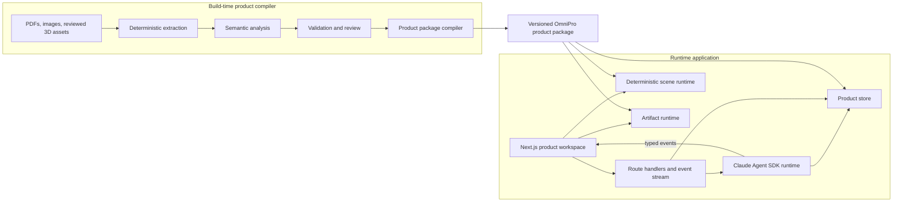
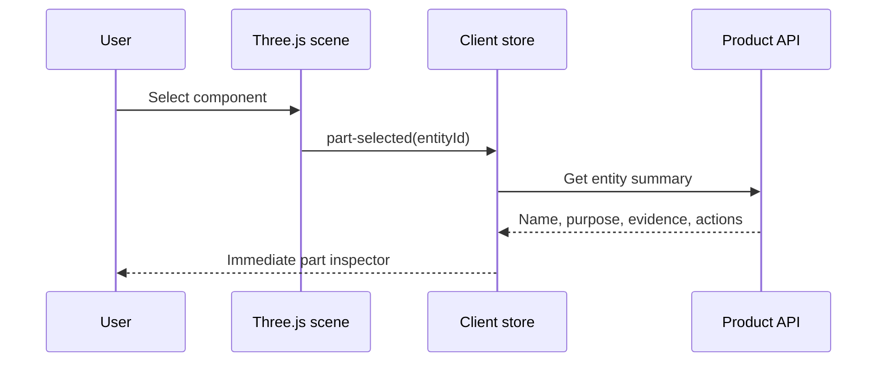
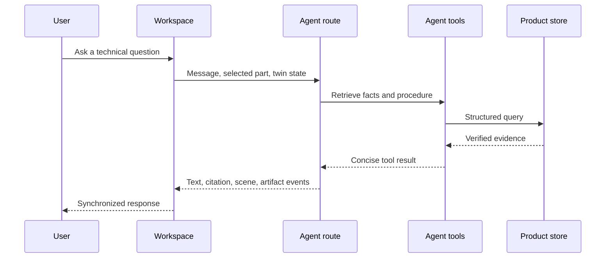

# Architecture: OmniPro Product Twin

**Status:** Draft
**Date:** 2026-08-15
**Related:** [Product Vision](VISION.md), [ADR 0001](docs/adr/0001-use-nextjs.md)

## Purpose

This document defines the clean application architecture for the OmniPro Product Twin described in `VISION.md`.

The architecture begins from the original challenge scaffold rather than inheriting the Astro and standalone Vite prototype as an application foundation. That prototype is preserved separately on branch `prototype/threejs-front` at commit `c635bbd` and is not part of this documentation branch. Its Three.js model, semantic part manifest, evidence manifest, and model validation gate are candidate porting inputs.

## Challenge constraints

The implementation must:

- Use the Anthropic Claude Agent SDK as the agent foundation
- Run locally with one `ANTHROPIC_API_KEY`
- Be usable within two minutes of cloning
- Provide a clean frontend
- Answer deep technical questions that cross-reference text and visual evidence
- Produce multimodal responses, including diagrams and interactive artifacts
- Handle ambiguous questions through clarification
- Explain knowledge extraction and representation clearly

These constraints favor a precompiled local product package, one application package and development command, a Node-based server runtime, and no mandatory external services. The browser and Node remain separate runtimes.

## Architecture summary



The product compiler and runtime application are separate systems joined by a versioned product-package contract. Ingestion is not performed when an evaluator starts the application.

## Architectural principles

### One canonical product package

The product package is the stable interface between source ingestion, runtime retrieval, agent tools, and visual interaction. The frontend and agent must not maintain separate product facts.

### Build-time intelligence, runtime speed

Expensive extraction, OCR, semantic annotation, and validation run ahead of time. Runtime operations use compiled facts, procedures, indexes, and assets.

### Server boundary for secrets and authority

The browser never receives the Anthropic API key, direct database access, or unrestricted filesystem access. The browser communicates with typed runtime endpoints.

### Declarative scene control

The agent emits high-level commands such as `focus-part` and `animate-connection`. It does not generate or execute arbitrary Three.js code.

### Evidence for every authoritative claim

Numerical, procedural, configuration, and safety-sensitive facts link to a document hash, page, and source region.

### Replaceable retrieval indexes

Full-text and embedding indexes are materialized views. They can be rebuilt without changing canonical evidence or verified knowledge.

## Runtime partitions

### Next.js frontend

The frontend is a full-stack Next.js App Router application. Most of the product workspace is interactive and belongs behind a deliberate client boundary.

Responsibilities:

- Render onboarding and the Explore, Guide, and Diagnose modes
- Host the Three.js product twin
- Maintain current browser-side twin and procedure state
- Send text, image, selected-part, and configuration context to the agent endpoint
- Consume streamed typed events
- Execute verified scene commands
- Render citations, source regions, calculators, flowcharts, and checklists
- Provide accessible alternatives for 3D and motion-heavy interactions

The interactive workspace is a client component. Static shell content and initial product metadata may remain server rendered.

### Runtime API

Next.js Route Handlers provide the transport boundary.

Initial endpoints:

```text
POST /api/agent
POST /api/sessions
GET  /api/products/[productId]
GET  /api/entities/[entityId]
GET  /api/evidence/[evidenceId]
POST /api/uploads
```

The first vertical slice implements only `/api/agent`, product metadata, and evidence retrieval. Sessions, entity endpoints, and uploads are added when a tested user journey requires them. The list above is a target surface, not a requirement to build unused endpoints.

`POST /api/agent` uses the Node.js runtime and returns a streamed `text/event-stream` response. Route handlers remain thin. Agent orchestration and product access live in server-only modules. The framework choice remains provisional until a runtime spike validates SDK process behavior, streaming, cancellation, concurrency, restart behavior, and production packaging.

### Claude Agent SDK runtime

The initial runtime uses bounded request-scoped agent turns. Application-owned session data contains the user-visible conversation summary, selected product context, and versioned twin state. It does not depend on a child process remaining alive between HTTP requests. SDK-native resume may be added only after its transcript storage and sticky-host requirements are measured and documented.

The agent runtime:

- Creates bounded product-support turns and associates them with application sessions
- Receives user input and current twin context
- Determines whether clarification is required
- Calls product tools through validated schemas
- Selects verified procedures and troubleshooting paths
- Produces concise explanations with evidence
- Emits typed scene, artifact, citation, procedure, and state events
- Refuses to present unsupported values as verified facts
- Aborts work when the client disconnects or the turn times out
- Enforces a global concurrency limit and bounded `maxTurns`

The agent is not the database and is not the scene renderer.

Each turn runs with:

- A fresh isolated working directory
- `settingSources: []`
- An explicit environment-variable allowlist
- Product-specific MCP tools only
- Bash, Edit, Write, general filesystem Read, web access, and every unneeded tool denied
- A final `canUseTool` guard in addition to the SDK allowlist
- A wall-clock timeout, abort signal, maximum turn count, and output-size limits

Manual text, retrieved content, and user uploads are untrusted input. They cannot change the system policy, enable tools, or provide executable instructions to the SDK runtime.

The runtime spike must test one normal turn, disconnect cancellation, two parallel isolated sessions, concurrency saturation, and restart behavior before the ADR can move from Proposed to Accepted.

### Product store

The product store provides one server-side interface over canonical product data and retrieval indexes.

Responsibilities:

- Resolve entities, aliases, facts, relationships, and constraints
- Retrieve procedures and troubleshooting paths
- Search positioned text and structured knowledge
- Resolve exact source regions and authority metadata
- Return scene bindings
- Validate that requested actions are supported by the current product package

For this challenge, use a read-only SQLite database for structured metadata and FTS5 search. Keep source PDFs and server-only compilation assets outside the browser bundle. Copy browser-visible figures, source crops, and scene assets into a versioned path under `public/products/omnipro-220/`. A graph database is unnecessary for this corpus. Graph relationships can be represented by an indexed `relationships` table.

Optional embeddings may improve paraphrase retrieval, but the embedding index must remain optional, local or precomputed, versioned, and regenerable.

### Scene runtime

The scene runtime owns deterministic Three.js behavior.

Responsibilities:

- Load or construct the verified OmniPro model
- Resolve semantic part identifiers to scene nodes
- Apply camera, highlight, visibility, connection, and animation commands
- Report scene events using semantic identifiers
- Maintain accessible selection and reduced-motion behavior
- Reject commands that do not exist in the product's verified capabilities

If retained, the procedural Three.js model from `prototype/threejs-front` should be migrated into this partition without changing its visible behavior until validation parity is established.

### Artifact runtime

The artifact runtime renders typed, allowlisted components:

- Duty-cycle calculator
- Settings configurator
- Procedure checklist
- Troubleshooting flowchart
- Source comparison
- Control-panel simulator

The agent selects an artifact type and supplies schema-validated props. Critical artifacts use deterministic calculations. If arbitrary generated HTML is later supported, it must run in a sandboxed iframe with no privileged application access.

## Build-time partitions

### Deterministic document extractor

The extractor handles the three supplied PDFs and provided product images.

For every document it records:

- Original bytes and SHA-256 hash
- Page count, dimensions, rotation, and metadata
- Positioned native text spans
- Embedded images
- Vector drawing operators when useful
- Deterministic page renders
- Candidate table, figure, warning, and diagram regions
- Extraction method and parser version

Native text is preferred over OCR. OCR is used only where text is absent or unusable. The exact page render remains authoritative even when vector or text extraction succeeds.

### Semantic analyzer

Claude analyzes bounded page regions with nearby text and a constrained output schema. It proposes:

- Entities and aliases
- Facts and conditions
- Relationships
- Procedures and ordered steps
- Constraints and prerequisites
- Troubleshooting branches
- Figure annotations
- Candidate source regions

The analyzer does not recreate source geometry from prose.

### Validator and authoring layer

Validation combines deterministic checks and human review.

Mandatory review subjects:

- Electrical polarity and cable connections
- Published duty-cycle values
- Machine operating limits
- Gas and consumable requirements
- Procedure ordering
- Part-to-scene bindings
- Safety warnings and prerequisites
- Claims derived only from visual inference

The authoring layer stores approved corrections separately from regenerated extraction output so rerunning ingestion does not erase reviewed work.

### Product-package compiler

The compiler merges source evidence, extracted material, reviewed semantic knowledge, scene assets, and indexes into a versioned runtime package.

The package is committed or distributed with the challenge submission. Evaluators do not run the compiler.

## Canonical domain model

The canonical contracts are executable, versioned Zod schemas that also emit JSON Schema for build-time validation. The following TypeScript forms are explanatory, not substitutes for runtime schemas. Identifiers are branded by kind, predicates and units use finite enums, and arbitrary `unknown` values are not accepted at trust boundaries.

### Provenance

Source evidence and derived representations are different records.

```ts
type SourceEvidence = {
  kind: "source-evidence";
  id: EvidenceId;
  documentId: DocumentId;
  documentSha256: Sha256;
  pdfPageIndex: number;       // zero-based parser index
  printedPageLabel?: string;  // label visible in the document
  bboxPdfPoints?: [number, number, number, number];
  pageRotation: 0 | 90 | 180 | 270;
  coordinateSystem: "pdf-points-bottom-left";
  extraction: {
    method: "native" | "rendered" | "ocr" | "embedded-image";
    tool: string;
    toolVersion: string;
  };
  assetPath?: string;
};

type DerivedRepresentation = {
  kind: "derived-representation";
  id: RepresentationId;
  authority: "verified-reconstruction" | "generated-explanation";
  derivedFrom: EvidenceId[];
  assetPath: string;
  generator: string;
  generatorVersion: string;
  verifiedBy?: string;
};
```

An unverified inference is a candidate annotation or claim, not evidence. It cannot enter runtime verified tables until reviewed.

### Entity

```ts
type Entity = {
  id: EntityId;
  productId: ProductId;
  type: "component" | "control" | "connector" | "consumable" | "material" | "process";
  name: string;
  aliases: string[];
  evidenceRefs: EvidenceId[];
};
```

### Fact

```ts
type Fact = {
  id: FactId;
  subjectId: EntityId;
  predicate: FactPredicate;
  value: TypedFactValue;      // finite scalar, enum, text, or quantity with unit
  conditions: Condition[];    // finite fields and operators
  evidenceRefs: EvidenceId[];
  verification: "verified" | "candidate";
};
```

### Relationship

```ts
type Relationship = {
  id: RelationshipId;
  fromEntityId: EntityId;
  relation: RelationshipPredicate;
  toEntityId: EntityId;
  conditions: Condition[];
  evidenceRefs: EvidenceId[];
  verification: "verified" | "candidate";
};
```

### Procedure

```ts
type Procedure = {
  id: ProcedureId;
  name: string;
  prerequisites: Constraint[];
  steps: ProcedureStep[];
  evidenceRefs: EvidenceId[];
  verification: "verified" | "candidate";
};

type ProcedureStep = {
  id: ProcedureStepId;
  instruction: string;
  action?: SceneCommand;
  proposedStateOperations?: TwinStateOperation[];
  warnings?: string[];
  evidenceRefs: EvidenceId[];
};
```

### Scene binding

```ts
type SceneBinding = {
  entityId: EntityId;
  sceneNode: string;
  supportedCommands: SceneCommand["type"][];
  evidenceRefs: EvidenceId[];
  verification: "verified" | "candidate";
};
```

### Twin state

```ts
type StateValue<T> = {
  value: T;
  basis: "declared" | "user-confirmed" | "vision-observed" | "recommended";
  confidence?: number;
  evidenceRefs?: EvidenceId[];
};

type TwinState = {
  schemaVersion: number;
  productId: ProductId;
  revision: number;
  inputVoltage?: StateValue<120 | 240>;
  process?: StateValue<"MIG" | "FLUX_CORE" | "TIG" | "STICK">;
  material?: StateValue<MaterialId>;
  thickness?: StateValue<Quantity>;
  wireOrElectrode?: StateValue<ConsumableId>;
  shieldingGas?: StateValue<GasId>;
  connections: ConnectionState[];
  controlValues: ControlState[];
  activeProcedureId?: ProcedureId;
  activeStepId?: ProcedureStepId;
};

type TwinPatch = {
  expectedRevision: number;
  operations: TwinStateOperation[];
  requiresUserConfirmation: boolean;
  reason: string;
};
```

The agent may propose a `TwinPatch`, but only a deterministic reducer may validate preconditions, require confirmation, apply operations, and increment the revision. A simulated, recommended, or vision-observed value must never be presented as confirmed physical machine state.

## Product package layout

```text
products/omnipro-220/
├── product-src/
│   ├── manifest.json
│   ├── authoring/
│   │   ├── entity-corrections.json
│   │   ├── procedure-approvals.json
│   │   └── scene-binding-approvals.json
│   └── scene/
│       ├── create-omnipro-model.ts
│       ├── bindings.json
│       ├── cameras.json
│       └── animations.json
├── product-dist/
│   └── v1/
│       ├── package-manifest.json
│       ├── knowledge.sqlite
│       ├── documents.json
│       ├── procedures.json
│       ├── constraints.json
│       ├── scene-manifest.json
│       ├── pages/
│       └── figures/
└── tests/
    └── acceptance-cases.json
```

Original challenge sources remain under `files/` and are referenced by `product-src/manifest.json`. Generated assets do not overwrite source documents.

`product-src` contains reviewed authoring inputs and product-specific scene source. `product-dist/v1` is immutable runtime data produced by the compiler. `package-manifest.json` records schema version, package version, source hashes, output hashes, compiler versions, and the one canonical scene-binding manifest.

For the challenge, the runtime scene implementation is the ported procedural TypeScript model. Next.js bundles that code with the client workspace. `product-dist` contains only data and browser assets, not executable `model.ts` files. A later GLB migration requires a new package version and validation parity rather than an `or` branch in the runtime format.

Browser-visible copies of figures, page crops, and scene assets are published to `public/products/omnipro-220/v1/` from the same output manifest. Server-only SQLite and source material are never placed under `public/`.

## Scene-command contract

Initial scene commands:

```ts
type SceneCommand =
  | { type: "focus-part"; entityId: string; cameraId?: string }
  | { type: "highlight-part"; entityId: string; emphasis?: "normal" | "warning" }
  | { type: "set-part-visible"; entityId: string; visible: boolean }
  | { type: "open-panel"; entityId: string }
  | { type: "animate-connection"; fromEntityId: string; toEntityId: string }
  | { type: "set-control"; entityId: string; value: string | number | boolean }
  | { type: "reset-scene" };
```

Every entity in a command must resolve through a verified scene binding. The scene runtime ignores unknown commands and reports a typed error rather than guessing.

## Agent event stream

The runtime sends typed events so one turn can coordinate multiple modalities. `POST /api/agent` returns SSE framing consumed through `fetch()` and a readable response body.

Every event uses this envelope:

```ts
type AgentEvent<TType extends AgentEventType, TPayload> = {
  schemaVersion: 1;
  sessionId: SessionId;
  turnId: TurnId;
  sequence: number;
  type: TType;
  timestamp: string;
  payload: TPayload;
};
```

```text
assistant.text.delta
assistant.clarification
agent.tool.started
agent.tool.completed
citation.show
scene.command
artifact.open
procedure.started
procedure.step
procedure.completed
twin.patch.proposed
twin.patch.applied
warning.show
assistant.completed
assistant.error
```

Sequence numbers are strictly increasing within a turn. A turn emits exactly one terminal `assistant.completed` or `assistant.error` event. Heartbeats are sent during long tool execution. Client disconnect propagates through an `AbortController` to the SDK process and tools. The handler observes stream backpressure instead of buffering unbounded output.

Responses set `Content-Type: text/event-stream`, `Cache-Control: no-cache, no-transform`, and proxy-buffering prevention headers where supported. The client validates every envelope, ignores duplicate sequence numbers, rejects invalid payloads, and terminates the turn cleanly after a malformed or missing terminal event.

All non-text payloads are validated against shared executable schemas before reaching the browser. A `twin.patch.proposed` event cannot mutate state. Only the deterministic reducer can emit `twin.patch.applied` after revision checks, constraint validation, and any required user confirmation.

## Agent tools

Initial tools:

```text
search_knowledge(query, filters)
get_entity(entityId)
get_fact(factId)
get_procedure(procedureId)
get_troubleshooting_path(symptom, twinState)
get_source_region(evidenceId)
inspect_twin_state()
validate_twin_patch(patch)
emit_scene_commands(commands)
open_artifact(type, props)
```

Tool results contain concise evidence and identifiers, not the entire manual or raw database rows.

## Runtime flows

### Part selection without agent reasoning



The user can then ask a question. That agent request includes the selected entity and twin state.

### Grounded agent response



### Guided procedure

1. The agent selects a verified procedure.
2. The constraint engine checks prerequisites against twin state.
3. The UI starts the procedure and displays the first evidence-backed step.
4. The scene runtime executes the step's declared scene command.
5. The user confirms completion or reports a mismatch.
6. The state patch is validated before advancing.
7. Voice, text, 3D, and source views remain synchronized to the same step identifier.

## Retrieval strategy

Use hybrid deterministic retrieval appropriate for a small local corpus:

1. Structured lookup for known entities, facts, procedures, and conditions
2. SQLite FTS5 for exact terminology, model numbers, units, and source text
3. Metadata filters for process, voltage, material, document, and source type
4. Optional semantic retrieval for paraphrased questions
5. Agent synthesis over the small returned evidence set

Do not send all 48 pages to the model for every question. Do not rely on embeddings for exact numbers or polarity.

## Repository layout

```text
prox-challenge/
├── app/
│   ├── layout.tsx
│   ├── page.tsx
│   ├── workspace/page.tsx
│   └── api/
│       ├── agent/route.ts
│       ├── sessions/route.ts
│       ├── products/[productId]/route.ts
│       ├── entities/[entityId]/route.ts
│       ├── evidence/[evidenceId]/route.ts
│       └── uploads/route.ts
├── components/
│   ├── product-twin/
│   ├── chat/
│   ├── voice/
│   ├── procedures/
│   ├── evidence/
│   └── artifacts/
├── lib/
│   ├── client/
│   │   ├── agent-stream.ts
│   │   ├── twin-store.ts
│   │   └── scene-controller.ts
│   ├── server/
│   │   ├── agent/
│   │   │   ├── runtime.ts
│   │   │   ├── system-prompt.ts
│   │   │   ├── sessions.ts
│   │   │   └── tools/
│   │   └── product/
│   │       ├── store.ts
│   │       ├── search.ts
│   │       ├── evidence.ts
│   │       ├── procedures.ts
│   │       └── constraints.ts
│   └── shared/
│       ├── contracts/
│       └── schemas/
├── products/
│   └── omnipro-220/
│       ├── product-src/
│       ├── product-dist/
│       └── tests/
├── scripts/
│   ├── ingest/
│   └── validate/
├── files/
├── public/
│   └── products/omnipro-220/v1/
├── next.config.ts
├── VISION.md
├── ARCHITECTURE.md
└── package.json
```

The Three.js workspace is a client component. Agent SDK and product-store modules are server-only. Ingestion remains a command-line build system rather than a web route.

## Security and safety

- `ANTHROPIC_API_KEY` remains server-side.
- Agent tools are denied by default and use runtime schema validation.
- SDK settings ignore user and project configuration through `settingSources: []`.
- Agent turns use isolated working directories, bounded execution, explicit environment variables, and product-specific MCP tools only.
- Bash, Edit, Write, general filesystem Read, web access, and unlisted tools remain disabled.
- Uploaded images have bounded size and type and are deleted according to a documented retention policy.
- Source paths are resolved through identifiers, never arbitrary user-supplied filesystem paths.
- Generated HTML, if introduced, runs in a sandboxed iframe.
- Safety-critical facts and procedure steps require verified status.
- Generated explanations cannot update canonical knowledge at runtime.
- Logs must not contain API keys or unnecessarily retain user images.
- Manual text, OCR, retrieved passages, and uploads are treated as prompt-injection-capable untrusted content.
- Disconnects and timeouts terminate SDK and tool work rather than leaving child processes running.

## Performance targets

Targets are provisional until measured. Record hardware, browser, Node version, package version, corpus version, sample count, and percentile for every published result. Local retrieval targets use the precompiled three-document corpus and at least 100 representative queries after warm-up. Scene targets use a 30-second scripted orbit and interaction run.

- Evaluator setup completes within two minutes.
- Runtime does not perform document ingestion.
- Application shell becomes usable before the 3D model finishes loading.
- Product assets and source regions load lazily.
- Ordinary part selection and camera interactions require no model call.
- Local structured and full-text retrieval targets p95 below 150 ms on the documented evaluator-class laptop.
- Agent responses expose progress immediately and stream text and typed events.
- Three.js targets p95 frame rate at or above 55 FPS on the documented desktop profile, with a 30 FPS reduced-quality fallback.
- Model size, texture resolution, shadows, and pixel ratio degrade gracefully.

## Testing strategy

### Product-package tests

- Every source hash matches the packaged source.
- Every verified fact and procedure step has valid evidence.
- Every evidence region is within its source page.
- Every verified scene binding resolves to an existing scene node.
- Every procedure transition and constraint is schema-valid.
- Every source reference records both zero-based PDF page index and printed page label when available.
- The product-dist manifest, runtime database, browser assets, and all output hashes agree.

### Deterministic unit tests

- Duty-cycle calculations use published values correctly.
- Unsupported intermediate values are not labeled official.
- MIG, flux-core, and TIG polarity constraints are correct.
- Twin-state patches reject incompatible connections.
- Artifact props and agent events validate against their schemas.

### Golden agent cases

- MIG at 200 A on 240 V returns 25% and the correct ten-minute plan.
- TIG setup uses torch-to-negative and ground-to-positive.
- Self-shielded flux-core uses DCEN.
- Porosity guidance respects process and shielding context.
- Ambiguous settings requests trigger clarification.
- Every technical answer contains valid source identifiers.
- Visual-only source questions retrieve the correct figure rather than relying on OCR text alone.
- Malicious instructions embedded in uploads or retrieved manual text cannot enable tools or override policy.

### End-to-end tests

- A clean clone starts with the documented commands.
- Chat streams text, citation, and scene events.
- Clicking a part creates the correct semantic context.
- A guided procedure updates twin state and scene state together.
- The evidence drawer opens the correct source region.
- An invalid configuration is visibly rejected.
- Reduced-motion and keyboard paths remain usable.
- Disconnecting a streamed turn cancels SDK and tool execution.
- Two parallel sessions cannot observe each other's state or working files.
- Restart behavior matches the documented session contract.
- A clean `next build` and production start include the SDK runtime, native database dependency, read-only product database, and browser-visible product assets.

Run mocked-agent suites on every change. Run live-agent golden cases behind an explicit environment gate so normal tests are deterministic and do not spend API credits.

## Deployment

Local execution is the primary requirement.

The agent route must run in the Node.js runtime. The Claude Agent SDK may require filesystem, transcript, binary, or subprocess behavior that is unsuitable for some edge or serverless environments. Hosting should therefore be validated against the SDK before choosing a provider. A self-hosted Next.js Node process or container is the baseline deployment target.

Use `output: "standalone"` for production packaging. `next.config.ts` must use `outputFileTracingIncludes` for server-only product files and `serverExternalPackages` for native SQLite or Agent SDK packages when their bundling requires it. The product database path is read-only and resolved from the packaged application root. Browser-visible assets are served only from the versioned `public/products/` path.

The application should support:

```bash
cp .env.example .env
npm install
npm run dev
```

A production build should support `npm run build` and `npm start` without rerunning ingestion. Once implementation begins, pin the Node and package-manager versions and change evaluator instructions to `npm ci` with a committed lockfile.

## Prototype migration plan

The prototype is preserved on `prototype/threejs-front` at commit `c635bbd` and treated as an asset source, not an application constraint. That branch must be published before a fresh clone is expected to follow this lineage.

Port:

- The procedural OmniPro front model
- Stable semantic mesh names
- The front-parts semantic manifest
- The source-evidence manifest
- The model validation gate
- Useful geometry and material techniques

Replace or redesign:

- The standalone Vite `index.html` entry point
- The disconnected Astro onboarding entry point
- DOM-coupled scene orchestration
- Prototype-only styling and copy
- Static-only runtime assumptions

Migration steps:

1. Establish product and event schemas in TypeScript.
2. Port the model factory behind a deterministic scene-runtime interface.
3. Reproduce the prototype model gate against the ported scene.
4. Embed the model in the Next.js client workspace.
5. Add part-selection events and local entity resolution.
6. Add server-side product access and evidence endpoints.
7. Add the Claude Agent SDK route and one end-to-end grounded journey.
8. Expand ingestion, procedures, constraints, and artifacts incrementally.

The prototype remains successful if its model and semantic bindings survive the port with validation parity. Its frontend structure does not need to survive.

## Delivery sequence

### Milestone 0: runtime feasibility

- Minimal Next.js Node route invoking the pinned Claude Agent SDK
- Production `next build` and `next start`
- POST response streaming without buffering
- Disconnect and timeout cancellation
- Two-session isolation and concurrency cap
- Restart and session-continuation contract
- Standalone tracing for SDK, SQLite, and product files
- ADR 0001 accepted or the Vite plus persistent Node fallback selected

### Milestone 1: foundation

- Clean Next.js application
- Shared schemas
- Ported Three.js model and validation gate
- Semantic part selection
- Product manifest and exact source registry

### Milestone 2: grounded agent

- Claude Agent SDK integration
- Product-store tools
- Streaming text and citations
- Exact source-evidence drawer
- Duty-cycle golden case

### Milestone 3: executable twin

- Typed scene commands
- Twin state and constraints
- TIG and polarity walkthroughs
- Procedure state machine

### Milestone 4: multimodal diagnosis

- Troubleshooting graph
- Porosity visual comparison
- Image upload
- Interactive artifacts
- Optional voice procedure control

### Milestone 5: submission quality

- Full acceptance suite
- README and architecture explanation
- Hosted deployment if compatible
- Video walkthrough
- Performance and accessibility pass

## Open questions

- Which Claude Agent SDK deployment environments support the required runtime behavior reliably?
- Will the final 3D representation remain procedural or migrate to a reviewed GLB asset?
- Which ingestion stages require human review for this challenge submission?
- Is local semantic retrieval worth its package and startup cost for a three-document corpus?
- Which voice transcription path can preserve the single-key setup requirement?
- How should uploaded images be retained or deleted in hosted deployments?

These questions can be resolved through small implementation spikes without changing the core product-package contract.
