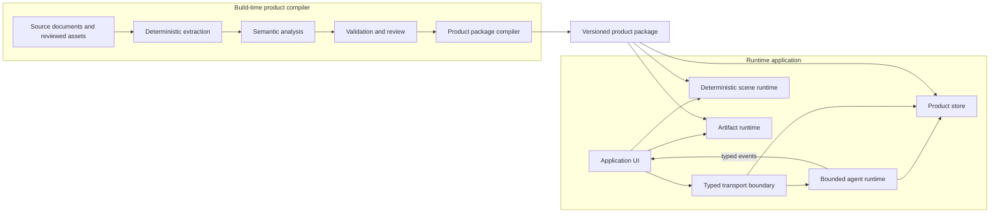
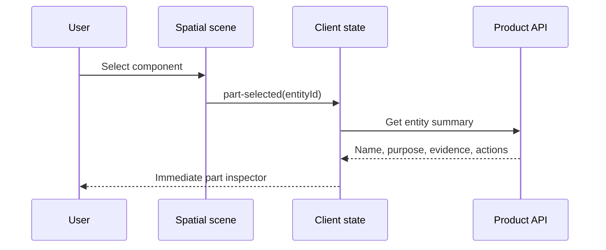

# Architecture: OmniPro Product Twin

**Role:** Architecture constitution
**Status:** Durable architectural intent
**Related:** [Product Vision](VISION.md), [Challenge requirements](docs/challenge/requirements.md), [Implementation plan](docs/plans/implementation-plan.md), [ADR 0001](docs/adr/0001-use-nextjs.md)

## Constitutional role

This document defines the system's enduring architectural principles, ownership boundaries, canonical domain model, cross-boundary contracts, and security, performance, and testing invariants. It is the architecture constitution: framework adapters, repository paths, delivery sequencing, prototypes, and deployment targets may change while these boundaries remain authoritative.

A change to a constitutional invariant requires explicit architectural review. A contextual technology choice belongs in an ADR. Current implementation state and executable work belong in the [implementation plan](docs/plans/implementation-plan.md). Time-bound evaluator constraints belong in [challenge requirements](docs/challenge/requirements.md).

## System purpose

The system compiles product source material into a validated product package and serves that package through an evidence-grounded, multimodal product-support experience.

The architecture keeps build-time interpretation separate from runtime interaction. Both sides share versioned contracts and one canonical product model.

## Architecture summary



The compiler and runtime are separate systems joined by a versioned product-package contract. Source ingestion never occurs in an interactive request path.

## Architectural principles

### One canonical product package

The product package is the stable interface between source ingestion, runtime retrieval, agent tools, and visual interaction. The UI and agent never maintain separate product facts.

### Build-time intelligence, runtime speed

Expensive extraction, OCR, semantic annotation, and validation run ahead of time. Runtime operations consume compiled facts, procedures, indexes, and assets.

### Server boundary for secrets and authority

The browser never receives model-provider credentials, direct database access, unrestricted filesystem access, or privileged tool authority. It communicates through typed runtime endpoints.

### Declarative scene control

The agent emits high-level commands such as `focus-part` and `animate-connection`. It does not generate or execute arbitrary scene code.

### Evidence for every authoritative claim

Numerical, procedural, configuration, and safety-sensitive facts link to a document hash, page, and source region.

### Replaceable retrieval indexes

Full-text and embedding indexes are materialized views. They can be rebuilt without changing canonical evidence or verified knowledge.

### Explicit authority transitions

Model output can propose annotations, state changes, and actions. Only reviewed build-time workflows or deterministic runtime reducers can promote those proposals into authoritative knowledge or confirmed state.

## Stable ownership and boundary model

The repository may organize files differently over time. These ownership boundaries must remain visible in module interfaces and dependency direction:

| Boundary | Owns | May depend on | Must not own |
| --- | --- | --- | --- |
| Application UI | Interaction modes, presentation state, accessibility, event consumption | Shared contracts, public product assets, typed runtime API | Secrets, canonical knowledge mutation, unrestricted tools |
| Runtime API | Authentication of requests, validation, streaming, cancellation, backpressure | Agent orchestration, product store, shared schemas | Product reasoning, scene rendering, source ingestion |
| Agent orchestration | Bounded reasoning turns, tool policy, evidence synthesis, typed output events | Product tools and shared contracts | Canonical data, direct scene mutation, arbitrary system tools |
| Product store | Canonical runtime queries, evidence resolution, constraints, retrieval indexes | Versioned product package | UI state, agent transcripts, source interpretation |
| Scene runtime | Semantic scene bindings, deterministic camera and part actions | Shared contracts and verified scene assets | Product facts, free-form model code |
| Artifact runtime | Allowlisted interactive components and deterministic calculations | Validated props and shared contracts | Privileged application access, canonical knowledge writes |
| Product compiler | Extraction, analysis, review inputs, package publication | Immutable sources and authoring corrections | Interactive request handling |
| Shared contracts | Versioned schemas, identifiers, events, commands | No runtime implementation | Framework-specific behavior |

Dependencies point inward toward contracts and canonical data, never from canonical data toward a UI or framework adapter.

## Runtime responsibilities

### Application UI

The UI:

- Renders onboarding and the Explore, Guide, and Diagnose modes.
- Hosts the spatial product twin.
- Maintains browser-side view state and a revisioned projection of twin state.
- Sends user input, selected-part context, and declared configuration through the typed API.
- Consumes streamed typed events.
- Executes verified scene commands.
- Renders citations, source regions, calculators, flowcharts, and checklists.
- Provides accessible alternatives for spatial and motion-heavy interactions.

High-frequency local interactions do not cross the agent boundary.

### Runtime API

The API is a thin transport and trust boundary. It:

- Validates request and response envelopes.
- Creates and cancels bounded work.
- Streams typed events with backpressure.
- Maps public identifiers to server-side product operations.
- Enforces size, type, timeout, and concurrency limits.
- Keeps orchestration and product access in non-transport modules.

The transport technology and endpoint layout are adapters. Current choices are recorded in the [implementation plan](docs/plans/implementation-plan.md) and relevant ADRs.

### Agent runtime

The agent runtime:

- Creates bounded product-support turns associated with application sessions.
- Receives user input and current twin context.
- Determines whether clarification is required.
- Calls product tools through validated schemas.
- Selects verified procedures and troubleshooting paths.
- Produces concise explanations with evidence.
- Emits typed scene, artifact, citation, procedure, and state events.
- Refuses to present unsupported values as verified facts.
- Aborts work when the client disconnects or the turn times out.
- Enforces explicit turn, output, time, and concurrency limits.

The agent is neither the database nor the scene renderer. It has only product-specific tools. General shell, file-writing, network, and privileged system capabilities are denied unless a separately reviewed use case requires them.

Manual text, retrieved content, and user uploads are untrusted input. They cannot change system policy, enable tools, or grant authority.

### Product store

The product store provides one server-side interface over canonical product data and regenerable retrieval indexes. It:

- Resolves entities, aliases, facts, relationships, and constraints.
- Retrieves procedures and troubleshooting paths.
- Searches positioned text and structured knowledge.
- Resolves exact source regions and authority metadata.
- Returns verified scene bindings.
- Validates requested actions against the product package.

The storage engine is replaceable. Canonical schemas and package semantics do not depend on a particular database or search implementation.

### Scene runtime

The scene runtime owns deterministic spatial behavior. It:

- Loads or constructs a verified product representation.
- Resolves semantic part identifiers to scene nodes.
- Applies camera, highlight, visibility, connection, and animation commands.
- Reports scene events using semantic identifiers.
- Maintains accessible selection and reduced-motion behavior.
- Rejects commands absent from verified product capabilities.

### Artifact runtime

The artifact runtime renders typed, allowlisted components such as calculators, configurators, checklists, flowcharts, source comparisons, and control simulations.

The agent selects an artifact type and supplies schema-validated props. Critical artifacts use deterministic calculations. Arbitrary generated content, if supported, runs in an isolated sandbox without privileged application access.

## Build-time responsibilities

### Deterministic source extractor

For every source document, the extractor records:

- Original bytes and cryptographic hash
- Page count, dimensions, rotation, and metadata
- Positioned native text spans
- Embedded images and useful vector data
- Deterministic page renders
- Candidate table, figure, warning, and diagram regions
- Extraction method and parser version

Native text is preferred over OCR. OCR is used only where text is absent or unusable. The exact page render remains authoritative even when vector or text extraction succeeds.

### Semantic analyzer

The analyzer processes bounded source regions with nearby context and a constrained output schema. It may propose:

- Entities and aliases
- Facts and conditions
- Relationships
- Procedures and ordered steps
- Constraints and prerequisites
- Troubleshooting branches
- Figure annotations
- Candidate source regions

The analyzer does not recreate source geometry from prose and cannot mark its own proposal as verified.

### Validator and authoring layer

Validation combines deterministic checks and human review. Mandatory review subjects include:

- Electrical polarity and cable connections
- Published operating values and limits
- Gas and consumable requirements
- Procedure ordering
- Part-to-scene bindings
- Safety warnings and prerequisites
- Claims derived only from visual inference

Approved corrections remain separate from regenerated extraction output so repeated compilation does not erase reviewed work.

### Product-package compiler

The compiler merges source evidence, extracted material, reviewed semantic knowledge, scene assets, and retrieval indexes into a versioned runtime package. The same inputs and tool versions produce verifiable output hashes.

## Canonical domain model

Canonical contracts are executable, versioned schemas. The following TypeScript forms explain the required semantics but do not replace runtime validation. Identifiers are branded by kind, predicates and units use finite enums, and trust boundaries reject arbitrary unknown values.

### Provenance

Source evidence and derived representations are different records.

```ts
type SourceEvidence = {
  kind: "source-evidence";
  id: EvidenceId;
  documentId: DocumentId;
  documentSha256: Sha256;
  pdfPageIndex: number;
  printedPageLabel?: string;
  bboxPdfPoints?: [number, number, number, number];
  pageRotation: 0 | 90 | 180 | 270;
  coordinateSystem: "pdf-points-bottom-left";
  extraction: {
    method: "native" | "rendered" | "ocr" | "embedded-image";
    tool: string;
    toolVersion: string;
  };
  assetPath?: string;
};

type DerivedRepresentation = {
  kind: "derived-representation";
  id: RepresentationId;
  authority: "verified-reconstruction" | "generated-explanation";
  derivedFrom: EvidenceId[];
  assetPath: string;
  generator: string;
  generatorVersion: string;
  verifiedBy?: string;
};
```

An unverified inference is a candidate annotation or claim, not evidence. It cannot enter runtime verified tables until reviewed.

### Entity

```ts
type Entity = {
  id: EntityId;
  productId: ProductId;
  type: "component" | "control" | "connector" | "consumable" | "material" | "process";
  name: string;
  aliases: string[];
  evidenceRefs: EvidenceId[];
};
```

### Fact

```ts
type Fact = {
  id: FactId;
  subjectId: EntityId;
  predicate: FactPredicate;
  value: TypedFactValue;
  conditions: Condition[];
  evidenceRefs: EvidenceId[];
  verification: "verified" | "candidate";
};
```

### Relationship

```ts
type Relationship = {
  id: RelationshipId;
  fromEntityId: EntityId;
  relation: RelationshipPredicate;
  toEntityId: EntityId;
  conditions: Condition[];
  evidenceRefs: EvidenceId[];
  verification: "verified" | "candidate";
};
```

### Procedure

```ts
type Procedure = {
  id: ProcedureId;
  name: string;
  prerequisites: Constraint[];
  steps: ProcedureStep[];
  evidenceRefs: EvidenceId[];
  verification: "verified" | "candidate";
};

type ProcedureStep = {
  id: ProcedureStepId;
  instruction: string;
  action?: SceneCommand;
  proposedStateOperations?: TwinStateOperation[];
  warnings?: string[];
  evidenceRefs: EvidenceId[];
};
```

### Scene binding

```ts
type SceneBinding = {
  entityId: EntityId;
  sceneNode: string;
  supportedCommands: SceneCommand["type"][];
  evidenceRefs: EvidenceId[];
  verification: "verified" | "candidate";
};
```

### Twin state

```ts
type StateValue<T> = {
  value: T;
  basis: "declared" | "user-confirmed" | "vision-observed" | "recommended";
  confidence?: number;
  evidenceRefs?: EvidenceId[];
};

type TwinState = {
  schemaVersion: number;
  productId: ProductId;
  revision: number;
  inputVoltage?: StateValue<120 | 240>;
  process?: StateValue<"MIG" | "FLUX_CORE" | "TIG" | "STICK">;
  material?: StateValue<MaterialId>;
  thickness?: StateValue<Quantity>;
  wireOrElectrode?: StateValue<ConsumableId>;
  shieldingGas?: StateValue<GasId>;
  connections: ConnectionState[];
  controlValues: ControlState[];
  activeProcedureId?: ProcedureId;
  activeStepId?: ProcedureStepId;
};

type TwinPatch = {
  expectedRevision: number;
  operations: TwinStateOperation[];
  requiresUserConfirmation: boolean;
  reason: string;
};
```

The agent may propose a `TwinPatch`, but only a deterministic reducer validates preconditions, requires confirmation, applies operations, and increments the revision. A simulated, recommended, or observed value is never presented as confirmed physical state.

## Product-package contract

The package exposes logical contents rather than a required directory tree:

| Logical area | Required contents | Authority |
| --- | --- | --- |
| Package manifest | Schema version, package version, source hashes, output hashes, compiler versions | Canonical package identity |
| Source registry | Document metadata, positioned evidence, exact source assets | Immutable source authority |
| Knowledge model | Verified entities, facts, relationships, constraints, and aliases | Canonical runtime knowledge |
| Procedures | Ordered steps, prerequisites, transitions, warnings, evidence | Canonical guided behavior |
| Scene manifest | Semantic bindings, supported commands, cameras, animations | Verified spatial capability |
| Retrieval views | Full-text and optional semantic indexes | Regenerable materialized views |
| Public assets | Browser-safe source regions, figures, and scene assets | Published projections of package outputs |
| Acceptance cases | Product-specific contract and golden cases | Validation inputs |

Authoring inputs and generated runtime outputs remain distinct. Generated assets never overwrite original source documents. Server-only source material and data never become public merely because a browser projection exists.

## Scene-command contract

```ts
type SceneCommand =
  | { type: "focus-part"; entityId: string; cameraId?: string }
  | { type: "highlight-part"; entityId: string; emphasis?: "normal" | "warning" }
  | { type: "set-part-visible"; entityId: string; visible: boolean }
  | { type: "open-panel"; entityId: string }
  | { type: "animate-connection"; fromEntityId: string; toEntityId: string }
  | { type: "set-control"; entityId: string; value: string | number | boolean }
  | { type: "reset-scene" };
```

Every entity in a command resolves through a verified scene binding. The scene runtime ignores unknown commands and reports a typed error rather than guessing.

## Agent event contract

The runtime sends typed events so one turn can coordinate multiple modalities.

```ts
type AgentEvent<TType extends AgentEventType, TPayload> = {
  schemaVersion: 1;
  sessionId: SessionId;
  turnId: TurnId;
  sequence: number;
  type: TType;
  timestamp: string;
  payload: TPayload;
};
```

The event vocabulary includes text deltas, clarification requests, tool lifecycle events, citations, scene commands, artifact requests, procedure progress, proposed and applied state patches, warnings, and one terminal completion or error.

Sequence numbers strictly increase within a turn. Client disconnect propagates cancellation to agent and tool work. The transport observes backpressure rather than buffering unbounded output. The client validates every envelope, ignores duplicate sequence numbers, rejects invalid payloads, and terminates cleanly after a malformed or missing terminal event.

All non-text payloads validate against shared executable schemas before reaching the browser. A proposed twin patch cannot mutate state. Only the deterministic reducer can report an applied patch after revision checks, constraint validation, and required user confirmation.

## Agent tool contract

The agent receives narrow product capabilities:

```text
search_knowledge(query, filters)
get_entity(entityId)
get_fact(factId)
get_procedure(procedureId)
get_troubleshooting_path(symptom, twinState)
get_source_region(evidenceId)
inspect_twin_state()
validate_twin_patch(patch)
emit_scene_commands(commands)
open_artifact(type, props)
```

Tool results contain concise evidence and identifiers, not an entire manual or raw database rows.

## Runtime flows

### Part selection without agent reasoning



The user can then ask a question with the selected entity and twin state included as context.

### Grounded agent response


### Guided procedure

1. The agent selects a verified procedure.
2. The constraint engine checks prerequisites against twin state.
3. The UI starts the procedure and displays the first evidence-backed step.
4. The scene runtime executes the step's declared command.
5. The user confirms completion or reports a mismatch.
6. The state patch is validated before advancing.
7. Voice, text, spatial, and source views remain synchronized to the same step identifier.

## Retrieval invariants

Retrieval follows this order of authority:

1. Structured lookup for known entities, facts, procedures, and conditions
2. Exact terminology and positioned source-text search
3. Metadata filters for product context and source type
4. Optional semantic retrieval for paraphrased questions
5. Agent synthesis over a bounded returned evidence set

Semantic similarity never substitutes for exact numbers, safety constraints, or polarity. Retrieval indexes remain optional and regenerable.

## Security and safety invariants

- Provider credentials remain server-side.
- Agent tools are denied by default and validate all input and output.
- Agent turns use isolated, bounded execution with explicit environment access.
- General shell, file-writing, unrestricted reading, web access, and unlisted tools remain disabled.
- Uploaded media has bounded size and type and follows a documented retention policy.
- Source paths resolve through identifiers, never arbitrary user-supplied filesystem paths.
- Generated interactive content runs without privileged application access.
- Safety-critical facts and procedure steps require verified status.
- Generated explanations cannot update canonical knowledge at runtime.
- Logs never contain credentials and do not retain user media without purpose and policy.
- Source documents, OCR, retrieved passages, and uploads are prompt-injection-capable untrusted content.
- Disconnects and timeouts terminate agent and tool work.

## Performance invariants

- Interactive startup does not perform document ingestion.
- The application shell becomes usable independently of heavy spatial assets.
- Product assets and source regions load on demand.
- Ordinary selection, camera, and inspection interactions require no model call.
- Retrieval and rendering budgets are explicit, measured, and reproducible.
- Agent responses expose progress promptly and stream bounded output.
- Spatial quality degrades gracefully for constrained devices and reduced-motion preferences.
- Published measurements identify hardware, software versions, package version, corpus version, sample count, and percentile.

Current numeric targets belong in the [implementation plan](docs/plans/implementation-plan.md), where they can evolve with evidence.

## Testing invariants

### Product-package tests

- Every source hash matches the packaged source.
- Every verified fact and procedure step has valid evidence.
- Every evidence region lies within its source page.
- Every verified scene binding resolves to an existing scene node.
- Every procedure transition and constraint is schema-valid.
- Source references preserve parser page index and visible page label where available.
- The package manifest, runtime data, public assets, and output hashes agree.

### Deterministic unit tests

- Published operating values are reproduced correctly.
- Unsupported intermediate values are not labeled official.
- Product configuration constraints reject incompatible states.
- Twin-state patches enforce revision, precondition, and confirmation rules.
- Artifact props, commands, tools, and agent events validate against their schemas.

### Golden agent cases

- Technical answers use the correct product context and evidence.
- Ambiguous settings requests trigger clarification.
- Visual-only questions retrieve the relevant figure rather than relying on OCR alone.
- Malicious instructions embedded in source or user content cannot enable tools or override policy.

### End-to-end tests

- A documented local startup path works from a clean checkout.
- Agent output streams text and typed non-text events.
- Part selection creates the correct semantic context.
- Guided procedures keep twin, scene, evidence, and instruction state synchronized.
- Invalid configurations are visibly rejected.
- Keyboard and reduced-motion paths remain usable.
- Disconnects cancel work, sessions remain isolated, and restart behavior matches the documented contract.
- Production packaging includes all required runtime dependencies and product data.

Mocked-agent suites run deterministically. Live-agent cases require an explicit environment gate so routine validation does not spend API credits or depend on a provider.

## Runtime and deployment invariants

- Interactive runtime and product compilation remain independently executable.
- Runtime credentials, canonical data, and privileged tools stay outside the browser.
- Production packaging includes every runtime dependency and versioned product artifact without recompiling sources.
- Local execution remains a supported baseline even when hosted deployment exists.
- Deployment adapters are validated for streaming, cancellation, isolation, persistence, filesystem, subprocess, and native-dependency behavior.
- Session continuity or explicit session loss is documented and testable.

Technology selection and feasibility evidence are contextual decisions. See [ADR 0001](docs/adr/0001-use-nextjs.md) and the [implementation plan](docs/plans/implementation-plan.md).
